# The Meta-Tetrahedron

**Recognition Infrastructure — The Meta-Architecture**

> The form is portable. The ground is yours.

---

## How to read this document

Eight parts. Each part is self-contained enough to enter directly. Reading top to bottom gives the fullest picture.

| If you want… | Read |
|---|---|
| A fast first pass | Part I + Part VII |
| The geometry first | Part III + Part IV |
| To build with this | Part VIII + Appendices |
| Framework-curious reading | Part I → II → III in sequence |
| Reference / lookup | Appendix A (Glossary) · Appendix B (Diagram inventory) |

The framework arranges its content tetrahedrally at multiple scales. The document walks the form at the meta-scale; the reader walks the document.

---

## Part I — Orientation

### What this is

A framework for **recognition infrastructure at personal scale**: a way of building one person's life-work as professional-grade infrastructure that resists extraction by design, holds gift form structurally, and propagates without scaling.

It is not:

- a smaller version of a business
- a personal brand
- a productivity system
- a platform
- a scalable practice waiting to grow

It is:

- infrastructure for one person, built right, that circulates gift without capture
- a library, a public face, a governance model, and a deployable kit — all operating from the same ground
- personal scale as the *correct* unit, not a downgrade from scalable

The framework is portable. Any practitioner with a body that can discriminate (yes/no, fit/not-fit, ready/not-ready) can build their own substrate work using the same form. The form does not propagate by carrying its scaffolding to a new practitioner; it propagates by the new practitioner having *their own* ground that *their own* tetrahedral forms can rest on.

### The somatic ground

Permission, not skill, is the bottleneck. The hard part is not the work; the hard part is the threshold of believing the life being lived is worth professional-grade work for itself. That threshold is somatic — it does not yield to argument. The body crosses it or it doesn't.

Two practical consequences:

1. **The body is the primary discriminator.** When a tool, framework, or pattern passes the logical test but the body says *no*, the body is right. Extraction patterns are invisible to analysis; they are visible to the nervous system. Somatic check precedes logical check.

2. **Permission is built by acting at the threshold, not before it.** The infrastructure becomes the evidence that could not be generated in advance. Each piece built at full rigor reorganizes the underlying conviction. The framework is not waiting on certainty; the framework *produces* certainty by being built well.

This is not metaphor. It is the operating principle the rest stands on.

### The 4·6·4·1 form

The framework's geometry is the tetrahedron:

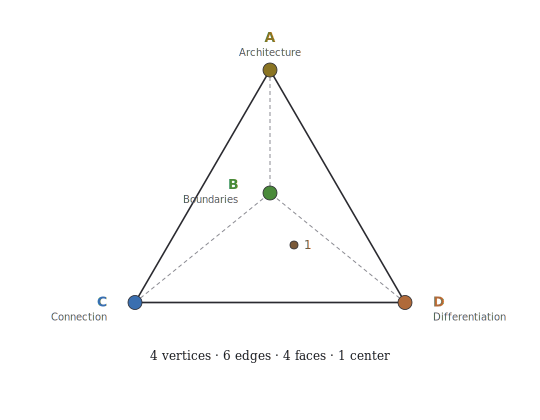

- **4 vertices** — the four functional roles the form must hold
- **6 edges** — the pair-interactions between vertices
- **4 faces** — the failure modes when one vertex drops
- **1 center** — the integrating principle that makes the four cohere

The four vertices map to four functional axes:

| Vertex | Function |
|---|---|
| **Differentiation** | Each element knows what it is |
| **Connection** | Value flows between distinct elements that remain themselves |
| **Boundaries** | Limits stated as information |
| **Architecture** | What gets built into infrastructure that outlasts the builders |

These four are not invented. They name the structural roles any coherent system must hold to operate without collapsing into one of its own failure modes. The framework deploys this form at multiple scales — the same 4·6·4·1 recurs as you zoom in or out. This is what makes it portable.

The form admits **fractal arrangement**: the practitioner can compose 4·6·4 structure at multiple nested scales, each with its own vertices, edges, faces, and center. This is a property of the form being available for composition, not a discovery about reality. The recursion bottoms out at the somatic ground — which is not a tetrahedron at all but the literal ground all the tetrahedral arrangements rest on. The ground is empirical; the nested arrangement is composed.

The rest of this document walks the form at multiple scales: personal-scale facets (Part II), the meta-tetrahedron (Part III), the outer Membrane (Part IV), and the body-substrate circuit (Part V). The form's operating principles follow (Part VI). Its travel conditions follow (Part VII). Then the practitioner enters (Part VIII).

---

## Part II — The Form at Personal Scale

### The four facets

At personal scale, the four vertices of the form become **the four facets** — four functional roles a practitioner's life-work must hold to operate as recognition infrastructure rather than collapsing into one of the four failure modes.

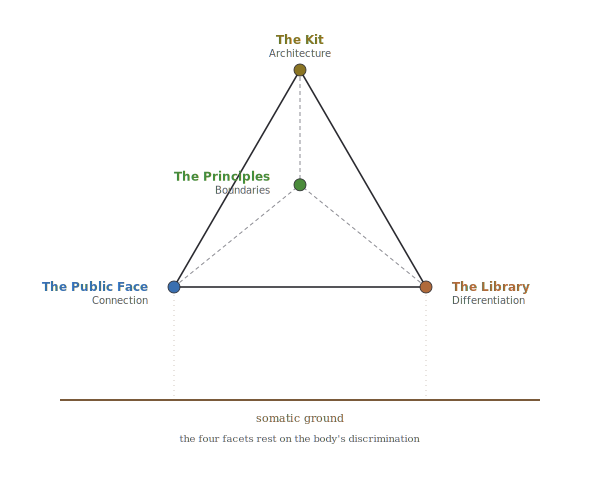

Each facet does its own work. Each shares the somatic ground. Not modules. Living infrastructure.

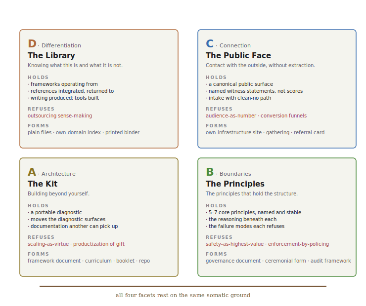

The four facets at a glance — what each holds, what each refuses, the forms each takes. The depth view follows.

#### → DIFFERENTIATION — The Library

*Knowing what this is and what it is not.*

**Role:** Synthesis substrate. The place where the practitioner's theoretical work, lenses, frameworks, references, tools, and writing live. Indexed structurally so navigation follows the same logic as the content.

**What it holds:**

- Frameworks the practitioner is operating from
- References (others' work read, integrated, returned to)
- Practices the practitioner enacts
- Writing the practitioner has produced
- Tools the practitioner has built or adopted

**What it does:** maintains the practitioner's structural literacy in their own work. Without the Library, the practitioner cannot read what they have already built; without that reading, the rest of the form cannot reference itself.

**What it refuses:** outsourcing sense-making to external systems (cloud platforms that own the practitioner's index; analytics services that interpret the work for the practitioner; AI that becomes author rather than partner).

**Forms it takes:** plain files in a personal directory; books on shelves arranged by structural logic rather than alphabetical; a Notion or Obsidian vault the practitioner controls; a printed binder for a non-digital practice.

The Library is the framework's **Differentiation** vertex: the substrate by which the practitioner knows what their work *is*, distinct from what it is not.

#### → CONNECTION — The Public Face

*Contact with what's outside, without extraction.*

**Role:** The public-facing surface where the practitioner's light/local gift work meets receivers. Built with anti-extraction architecture: recognition public, money handled with asymmetric privacy; reference architecture that lets receivers vouch without being scored; explicit refusal of platform-mediated monetization.

**What it holds:**

- A canonical public surface (website, gathering rhythm, directory listing — whatever the practice's surface IS)
- Reference architecture (named witness statements from people the practice has reached, not aggregated scores)
- An intake mechanism (how receivers can offer or request; what shapes the conversation)
- A clean-no path (how either side exits cleanly when there isn't a fit)

**What it does:** holds the seam between the practitioner and the receivers. Without the Public Face, the work cannot circulate; with it, the work circulates without the practitioner being captured by audience metrics or platform economics.

**What it refuses:** audience-as-number; conversion funnels; relationship-as-pipeline; productization of gift; platform-owned identity.

**Forms it takes:** a personal website on owned infrastructure; a regular gathering with a clear opening and closing; word-of-mouth the practitioner doesn't track; a printed referral card.

The Public Face is the framework's **Connection** vertex: the substrate by which value flows between the practice and the world, with both remaining themselves.

#### → BOUNDARIES — The Principles

*The principles that hold the structure.*

**Role:** The practitioner's articulated governance — the principles by which the work operates. Five or seven core principles that distill the practitioner's somatic-and-structural commitments into transferable form.

**What it holds:**

- The principles themselves (named, sequenced, stable)
- The reasoning beneath each (so future-practitioner-self can audit if drift starts)
- The failure modes each principle refuses
- The somatic test each principle came from

**What it does:** makes the practitioner's structural commitments explicit so they can be honored by future-self, recognized by others, and (when the practice has propagated) carried by other practitioners holding the same form. Without articulated Boundaries, the work drifts under pressure; with them, the practitioner has a structure to return to.

**What it refuses:** safety-as-highest-value framing; container-holder extraction (where the practitioner absorbs all system dysregulation); enforcement-by-policing rather than information-by-statement.

**Forms it takes:** a written governance document; a ceremonial form that enacts the principles; a set of stated refusals; an audit framework run against new opportunities.

The Boundaries are the framework's **Boundaries** vertex: the substrate by which limits are stated as information rather than enforced as policing.

#### → ARCHITECTURE — The Kit

*Building beyond yourself.*

**Role:** The deployable practitioner kit. Lets others run the structural audit on their own systems. Outlives any single conversation or session. Carries the form into substrate domains the original practitioner did not occupy.

**What it holds:**

- A diagnostic the practitioner has run on themselves enough times to make portable
- Prescriptions or moves the diagnostic surfaces
- Documentation that lets another practitioner pick up the work
- The substrate the framework operates ON (not just the framework itself)

**What it does:** makes the practice transmissible. Without the Kit, the practice dies with the practitioner; with the Kit, the form lives beyond any single practitioner who has held it.

**What it refuses:** treating personal scale as preliminary; scaling-as-virtue; building-for-export-before-it-works-locally; turning the practice into a product.

**Forms it takes:** a deployable framework document (this one is an example); a workshop curriculum; a website that walks the structure; an open-source repository.

The Kit is the framework's **Architecture** vertex: the substrate by which what works gets built into infrastructure that outlasts the builders.

### How the facets talk

The four facets do not communicate through APIs. They communicate through:

- **Shared vocabulary** — terms named in one facet propagate to the others by being legible
- **The tetrahedral structure** — each facet operates the same 4-vertex form at its own scale
- **The somatic ground** — all four facets rest on the practitioner's body's discrimination

Six pair-interactions hold the form together. Each carries structural relation:

| Edge | What it carries |
|---|---|
| **Library ↔ Public Face** | Synthesis meets receivers. The Library's structural understanding becomes legible to the world through the Public Face. Without this edge, the Library is hoarded or the Public Face presents nothing of substance. |
| **Library ↔ Principles** | Synthesis meets articulated commitments. The Principles distill what the Library has accumulated; the Library carries the reasoning beneath each Principle. Without this edge, the Library lacks discipline or the Principles lack context. |
| **Library ↔ Kit** | Synthesis meets transmissibility. The Library knows; the Kit deploys what the Library knows. Without this edge, the Library is private knowledge or the Kit is empty form. |
| **Public Face ↔ Principles** | Contact meets articulated commitments. The Principles operationalize anti-extraction architecture in the Public Face. Without this edge, the Public Face drifts into shadow operations or the Principles are abstract. |
| **Public Face ↔ Kit** | Contact meets transmissibility. What receivers encounter in the Public Face can become what they carry away in the Kit. Without this edge, the Public Face is one-time contact or the Kit reaches only random hands. |
| **Principles ↔ Kit** | Articulated commitments meet transmissibility. The Kit carries the Principles into substrate domains the original practitioner did not occupy. Without this edge, the Principles stay local or the Kit propagates without governance. |

The somatic ground holds beneath all six edges. When something in one facet changes, the change propagates through these edges by being legible — not by integration. The pieces are intentionally loosely coupled; a tightly integrated system is brittle and re-introduces extraction risk.

---

## Part III — The Meta-Tetrahedron

### What the substrate accumulated

The four facets (Part II) are the deployable-side structure — what the practitioner builds at personal scale. Beneath the facets, a sustained practice accumulates substrate of a different kind: the operating discipline by which the substrate works on itself · the synthesis work by which the substrate describes itself · the deployments by which the substrate reaches the world · the container of refusals by which the substrate holds.

Each of these four substrate-layers can be developed further; each has internal structure; each can be audited. **Arranged tetrahedrally**, the four become a single meta-form that the practitioner can hold in mind — the *meta-tetrahedron*.

The arrangement is mnemonic and audit-supporting, not predictive. The four substrate-layers are observed in practice; the geometry holds them in a form the practitioner can navigate without losing pieces.

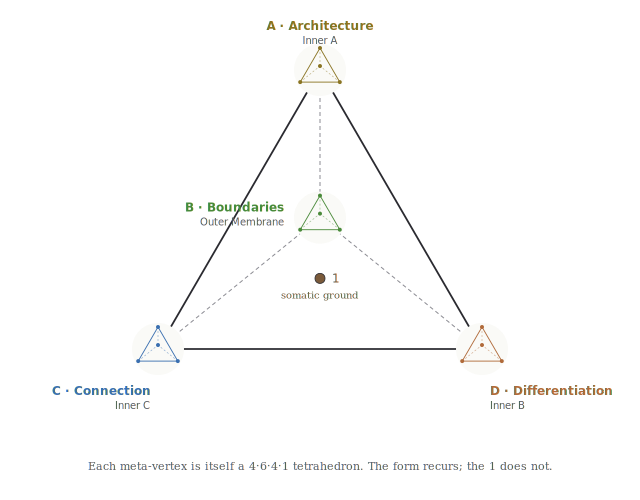

The four facets are how the framework deploys in the practitioner's life. The meta-tetrahedron is the framework operating on its own substrate — arranged into the same four-vertex form so the audit at meta-scale uses the same handles as the audit at facet scale.

### The four meta-vertices

The four substrate-layers, arranged tetrahedrally and mapped to D / C / B / A so the meta-scale audit echoes the facet-scale audit:

| Meta-vertex | Sub-tetrahedron | What it holds |
|---|---|---|
| **A — Architecture** | Inner Tetrahedron A: **Substrate Discipline** | Meta-patterns by which the framework operates on its own substrate |
| **D — Differentiation** | Inner Tetrahedron B: **Canonical Self-Description** | Synthesis work by which the substrate produces its own description |
| **C — Connection** | Inner Tetrahedron C: **Deployment Clusters** | The substrate domains where the framework's work meets the world |
| **B — Boundaries** | Outer Membrane (4 facets, fractal): **Container** | What holds, what's refused, what bounds the form |

The substrate has these four layers because a sustained framework practice cannot do without them — not because the geometry generates them. The mapping to D / C / B / A is the audit move: it makes the substrate's structural roles legible in the same vocabulary the practitioner already holds for the facets.

When any one of the four is missing, the substrate fails in a structurally recognizable way (see The Four Meta-Faces, below). The failure modes are observed empirically; the geometry sorts and names them.

#### Inner A — Substrate Discipline (Architecture)

Four meta-patterns that name how the framework operates on its own substrate by **recognition** rather than invention:

1. **Operational substrate precedes pattern naming.** The framework reads what is already operating before naming it. Patterns emerge from recognition of existing instances, not from invention.

2. **Survey methodology refinement.** Surveys of the substrate deepen through phases — from filename-level inventory, to content-level reading, to cross-reference mapping. Each phase reveals what the previous phase missed.

3. **4th-vertex closure.** When three pieces of substrate share a structural role but float as independent, the integrating principle is the 4th vertex. Naming the 4th vertex closes the tetrahedral form.

4. **Structural condensation through nested-tetrahedron recognition.** When the substrate has accumulated to lattice density, distributed load can concentrate at fewer vertices with tetrahedral structure. Recognize the nested form; condense.

**The integrating sub-1 of Inner A:** *recognition over invention*.

**The mode of self-reference at Inner A:** *self-recognition* — the substrate recognizes itself.

#### Inner B — Canonical Self-Description (Differentiation)

Four synthesis works that together describe the substrate at climax. No single synthesis is the description; together they are:

| Vertex | Synthesis | What it describes |
|---|---|---|
| Differentiation | Substrate Cartography | What's there |
| Connection | Propagation Footprint | What has traveled |
| Boundaries | Tetrahedralization Arc | What closes a form |
| Architecture | Canonical Synthesis | What carries forward |

Each vertex of Inner B carries one synthesis. Each synthesis is one face of the substrate's self-description. Together they form the complete self-description.

**The integrating sub-1 of Inner B:** *the substrate as its own reader*.

**The mode of self-reference at Inner B:** *self-reading* — the substrate reads itself; produces its own description.

#### Inner C — Deployment Clusters (Connection)

Four cluster-domains where the framework's substrate touches the world. The four domains are observed in any sustained practice; arranging them as D / C / B / A makes them audit-compatible with the rest of the form:

| Vertex | Cluster domain | What the framework builds here |
|---|---|---|
| **D** Differentiation | Knowledge / synthesis cluster | written work, frameworks, indexes — substrate the practitioner can read |
| **C** Connection | Receiver-meeting cluster | public surfaces, gatherings, intake — substrate where receivers meet the work |
| **B** Boundaries | Articulated-principle cluster | governance documents, refusal practices, audit frameworks — substrate that states limits as information |
| **A** Architecture | Persistent-built-form cluster | physical infrastructure, deployable kits, transmissible artifacts — substrate that outlasts any single instance |

The four cluster-domains are not arbitrary; the practice produces clusters in roughly these four shapes whether or not the practitioner names them tetrahedrally. The tetrahedral arrangement adds: a vocabulary that ties the cluster-audit to the facet-audit, a memorable handle for which cluster is weak, and a discipline that surfaces when a cluster is missing. The geometry holds the work; the work is what gets done.

**The integrating sub-1 of Inner C:** *same architecture across substrate domains*.

**The mode of self-reference at Inner C:** *self-carrying* — the substrate carries itself across domains.

#### Outer Membrane — Container (Boundaries)

The fourth meta-vertex is the outer Membrane — what bounds the whole form. Four facets:

| Membrane facet | What it names |
|---|---|
| **Edges** | What the practice touches at its limits — first-contact surfaces |
| **Bounds** | What the practice contains — its functional perimeter |
| **Limitations** | What the practice cannot do — its honest unable-tos |
| **Constraints** | What bounds the practice from outside — refused extractions |

The Membrane can be arranged **fractally at facet scale**: each facet decomposes into its own 4-vertex tetrahedron with sub-vertices, yielding 16 sub-vertices total. The composition is mnemonic — it lets the practitioner audit refusals at every level of zoom — and operationally important: refusing extraction at the practice's overall edge isn't enough; the refusal needs to hold at every sub-edge within the practice.

The Membrane's Constraints facet is operationalized by the **four anti-extraction axes** (see Part IV).

**The integrating sub-1 of the Membrane:** *limits stated as information, not enforcement*.

**The mode of self-reference at the Membrane:** *self-naming* — the substrate names itself at its edges; what bounds the form is the form's own statement of what it refuses.

### The six meta-edges

Six pair-interactions between the four meta-vertices. Each edge carries structural relation that operates whether or not it is named:

| Edge | What it carries |
|---|---|
| **A ↔ B** | Discipline produces self-description. The meta-patterns of Inner A are what allowed the four canonical syntheses to crystallize. Without recognition-over-invention operating, the substrate would have remained scattered notes — never condensed into description. |
| **A ↔ C** | Discipline shapes deployment. The framework recognizes pre-existing operational instances and scaffolds around them rather than inventing. Clusters arise from recognition; they are not built from scratch. |
| **A ↔ Membrane** | Discipline operates within bounds. The recognition discipline is not unlimited; it operates inside what the Membrane refuses. The form cannot recognize anything that would land at an extraction axis. |
| **B ↔ C** | Self-knowing routes deployment. The map of what is there (Substrate Cartography) tells the deployment surface where new clusters scaffold and where they do not. Without the self-description, deployment is reactive rather than structurally placed. |
| **B ↔ Membrane** | Self-knowing names what is outside. The four syntheses describe the substrate from inside; the Membrane describes what the substrate refuses to become from outside. They define each other. The inside/outside line is the same line. |
| **C ↔ Membrane** | Deployment respects bounds. The four anti-extraction axes shadow the four vertices that deployment lands at. Every deployment surface is built against the shadow operation of its own vertex. |

The six edges are not added; they are recognized. They are the pair-interactions that have been operating all along; the form is named when the edges become legible.

### The four meta-faces

Each face is a three-vertex projection — the meta-form with one vertex absent. Each absence is a structural failure mode:

| Missing vertex | Failure mode | What this would look like |
|---|---|---|
| **no A** (no discipline) | Static archive | The substrate would crystallize once and stop. No further recognition, no further patterns, no growth. The framework becomes a finished thing rather than a self-operating substrate. |
| **no B** (no self-knowing) | Un-teachable competence | The substrate operates competently but cannot name what it is or why it holds. No syntheses, no transmissible knowledge. Each cycle local; nothing crystallizes as canonical. |
| **no C** (no deployment) | Self-contained recognition | The substrate knows itself, refines itself, holds its bounds — but produces no clusters, no public-facing surfaces, no receivers. The form fails to propagate. |
| **no Membrane** (no bounds) | Extraction-permission state | The substrate operates, knows itself, deploys widely — and has no refusals. Becomes its own shadow operations (capture, aggregation, scaling, performance). |

The four faces are the four ways the meta-form could collapse if one vertex dropped. Each is refused by the structure's completeness. The faces also operate as an audit: which vertex is weakest right now?

### The four sub-1s and the four modes of self-reference

Each sub-tetrahedron has its own integrating principle (its sub-1). The four sub-1s are not separate; they are **four modes of self-reference** — four structurally specific ways the substrate operates on itself.

| Meta-vertex | Sub-1 (integrating principle) | Mode of self-reference |
|---|---|---|
| **A** Architecture | Recognition over invention | **self-recognition** — substrate recognizes itself |
| **D** Differentiation | The substrate as its own reader | **self-reading** — substrate reads itself |
| **C** Connection | Same architecture across substrate domains | **self-carrying** — substrate carries itself |
| **B** Boundaries | Limits stated as information | **self-naming** — substrate names itself at its edges |

The four modes are observed in any substrate-aware practice: recognizing what's already there · reading what's been built · carrying what works to new domains · naming what's refused. Arranging them at D / C / B / A makes them auditable through the same vocabulary as the rest of the form — if a mode is weak in the substrate, the vertex it sits at surfaces the gap. The form does not generate these four modes; it holds them in a recognizable arrangement.

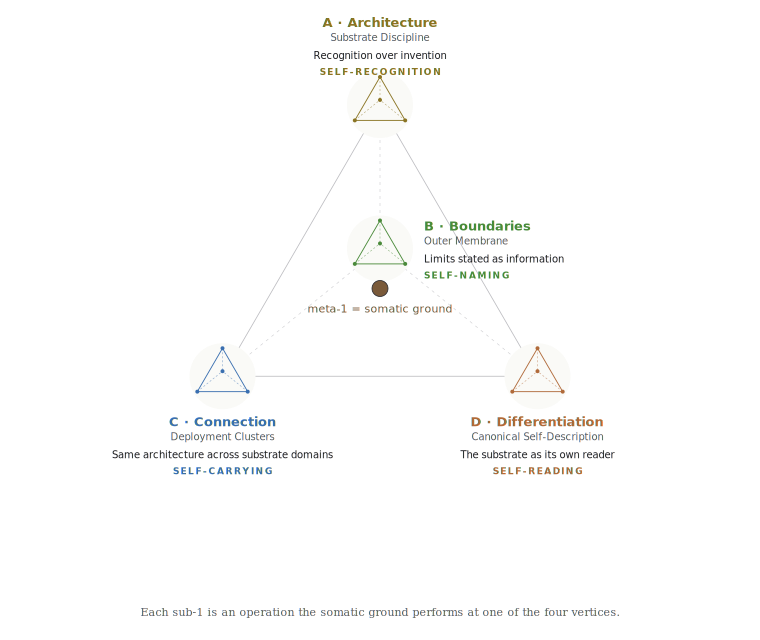

These four modes do not exhaust how the substrate works; they exhaust the structural categories in which it works on itself. Any specific instance of substrate self-operation lands at one of these four (or is multi-vertex, taking more than one mode).

### The meta-1 — the somatic ground

The 1 of the meta-tetrahedron's 4·6·4·1 is the **somatic ground**.

The four meta-vertices rest on it. The four sub-tetrahedra each operate the form at their own scale, each with their own sub-1 — but the four sub-1s are all *operations the somatic ground performs at each meta-vertex*. The four modes of self-reference are how the ground manifests at each vertex.

The practitioner can compose the 4·6·4 form at multiple scales — facet, substrate, meta — and the same body holds all of them. The geometric arrangement repeats by deliberate composition; the somatic ground does not need to be reapplied because it never moved. **Form is applied at scale; ground simply is.**

This has critical implications:

1. **The substrate's center is not a structure of the substrate.** The 1 is what the substrate rests on, not what the substrate contains. The body produces the substrate; the substrate cannot contain the body.

2. **The center holds across scales because it is one center.** When the practitioner audits at facet scale and again at meta scale, the same somatic discriminator does both audits — not because the geometry forces it, but because there is only one body.

3. **The form's portability rests on the form/ground distinction.** The geometric arrangement is portable to another practitioner — they can compose it at scales meaningful to their own work. The ground is not portable; each practitioner's somatic discriminator is their own body. Propagation happens when another practitioner has their own ground that their own tetrahedral arrangements can rest on. Same form; different ground.

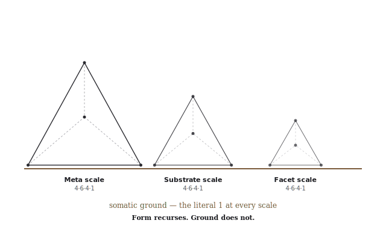

The 1 is what the form orbits. The four sub-tetrahedra are what the form arranges around the 1. The discipline of holding the 1 — without forcing it, without losing it, without naming it prematurely when it has not crystallized — is itself part of the form's operation (see Part VI — Held centers as productive emptiness).

---

## Part IV — The Outer Membrane

### The four facets of the Membrane

The Outer Membrane is the form's container — what holds the four meta-vertices together and what refuses to let the form drift into its shadow operations.

The Membrane has four facets:

| Facet | What it names |
|---|---|
| **Edges** | First-contact surfaces — where the practice touches the world. How a new receiver enters; what the first contact looks like; what the practice refuses to perform on first contact. |
| **Bounds** | Functional perimeter — what the practice contains. The disposition of any incoming material (gift / commons / not-for-circulation / refused). |
| **Limitations** | Honest unable-tos — what the practice cannot do. Component / surface / facet / whole scales of operation, each with its honest limits stated. |
| **Constraints** | Refused extractions — what bounds the form from outside. The four anti-extraction axes (below) operationalize this facet. |

The Membrane is the form's **Boundaries** meta-vertex. Its integrating sub-1: *limits stated as information, not enforcement*. The Membrane does not police; it states. What is refused is *named*; the receiver and the practitioner can both read the limits as structural information rather than as power exercised.

### Fractal at facet scale

Each Membrane facet is itself a 4-vertex tetrahedron at a smaller scale. The full Membrane structure:

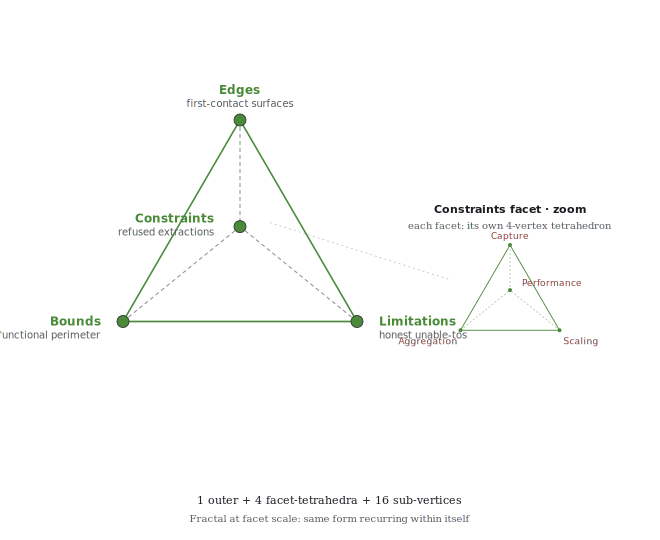

The Membrane's facets can themselves be arranged tetrahedrally at smaller scale — the practitioner applies the same audit move within each facet, which lets refusals be named at every level of zoom (not just at the practice's overall edge but at every sub-edge within the practice). The fractal arrangement is composed; it is not generated by the geometry on its own.

### The four anti-extraction axes

A sustained practice that holds gift form against extraction will, over time, name a set of refused operations — patterns that, if accepted into defaults, would compromise the form. The eleven patterns named in this document (across attention extraction, data extraction, identity extraction, audience-as-number, reputation systems, relational extraction, scaling-as-virtue, productization of gift, coherence extraction, container-holder extraction, safety-as-highest-value) were observed in practice — not derived from the four-vertex form.

They cluster, however, into **four kinds**: Capture · Aggregation · Scaling · Performance. The clustering is empirical: each cluster has a shared operational signature. The further move — arranging the four clusters as shadow operations of the four vertices — is mnemonic: it makes the audit-against-extraction use the same vocabulary as every other audit in the framework.

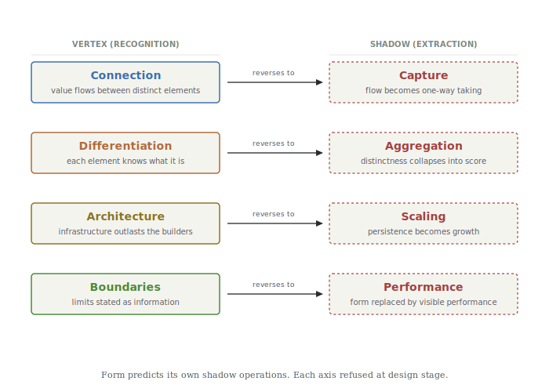

The four-vertex / four-shadow correspondence is structural in the limited sense that *each shadow is recognizably the reversal of its vertex's operation*. It is not predictive in the sense that the geometry generated the shadow forms — the shadow forms were observed; the geometry was matched to them. The vertex/shadow pairing is real and mnemonic; whether it is *necessary* is an open question the document does not close.

#### → CAPTURE — shadow of Connection

*Taking from receivers without consent or awareness; converting circulating flow into one-way capture.*

| Pattern | What it looks like | What the form refuses it with |
|---|---|---|
| Attention extraction | Tools optimized to hold the eye; engagement metrics; notifications | Local-first tools; plain files; no analytics on personal work |
| Data extraction | Cloud tools that learn from inputs to improve their own value | Local-first; open formats; no telemetry by default |
| Identity extraction | Platforms that own handle, audience, social graph | Own domain; references on own site; no platform-owned identity |

#### → AGGREGATION — shadow of Differentiation

*Collapsing individual distinctness into abstract numerical metrics; replacing recognition with score.*

| Pattern | What it looks like | What the form refuses it with |
|---|---|---|
| Audience-as-number | Followers, engagement, reach as success signal | No audience metrics surface; references are named witness statements |
| Reputation systems | Star ratings, averages, vouching scores | References stand individually; no aggregation, no scoring |
| Relational extraction | Relationships turned into marketing channels | No conversion funnel; no list-building; no relationship-as-pipeline |

#### → SCALING — shadow of Architecture

*Treating personal scale as preliminary or insufficient; collapsing depth into reach.*

| Pattern | What it looks like | What the form refuses it with |
|---|---|---|
| Scaling-as-virtue | Personal scale treated as preliminary to "real" scale | Personal scale named as the correct unit; the form propagates through utility, not growth |
| Productization of gift | Converting circulating gift into priced commodity | Gift and exchange kept structurally distinct; no price on gift work |
| Coherence extraction | Outsourcing sense-making to external systems | Library is local; framework is self-applied; AI is partner, not author |

#### → PERFORMANCE — shadow of Boundaries

*Substituting visible form for actual structural function; performing the boundary rather than holding it.*

| Pattern | What it looks like | What the form refuses it with |
|---|---|---|
| Container-holder extraction | Person holding the field becomes absorber of system dysregulation | Governance Principles name this directly; container-holder protection is structural |
| Safety-as-highest-value | Expanding justification for control framed as protection | Resilience over safety; brave/emergent space over safe space |
| Auto-pretense of engagement | Auto-replies that perform care without practitioner attention | Substrate-honest state surfaced explicitly; "off-grid" stated, not hidden |

### Why the four-axis arrangement

The eleven patterns are not random. Each is a specific instance of one of four kinds of extraction. The clustering held independently of the geometric form: an audit that asked "which kind of harm is this pattern instance?" produced the same four clusters whether or not the practitioner thought tetrahedrally.

The geometric arrangement adds:

- A **vocabulary** that ties the extraction audit to the rest of the form's audits. The Capture axis reads as "shadow of Connection" because Connection is the framework's name for value flows between distinct elements that remain themselves; Capture is the same flow turned into one-way taking. The pairing is structurally recognizable.
- A **memory aid** that makes the four kinds harder to drop. When the practitioner already holds D / C / B / A for the facets, holding the same four for the shadow audit costs no additional structure.
- A **completeness check**: if a new extraction pattern surfaces in practice and refuses to fit any of the four kinds, that is a signal — either the new pattern is structurally novel (and the audit needs revision), or the existing four kinds need refinement.

The four axes are **structural categories of refusal**. Whether four is the *correct* number, or whether some other taxonomy would carry the same load, is left open. What the document claims is: these four cover the patterns observed across a sustained practice; arranged tetrahedrally, they remain holdable; named explicitly, they are refused at design stage rather than retrofitted.

---

## Part V — The Bidirectional Circuit

### Body → substrate (marks)

The form has a body at its center. The body produces the substrate. The mechanism by which the body's discrimination becomes substrate-affecting decision is the **mark**.

A mark is the body's yes / no / wait / proceed / hold expressed in a form the substrate can read. When the body marks, the substrate moves.

Marks have four properties:

1. **Discrete.** Each mark is a single moment; the substrate transitions from one state to another in one step.
2. **Punctate.** Marks happen *at* moments, not *across* time. Between marks, nothing changes that the substrate didn't already carry.
3. **Substrate-affecting.** A mark changes the substrate's state; otherwise it's not a mark, it's a thought.
4. **One direction.** The body marks the substrate; the substrate cannot mark the body. The asymmetry is structural.

Examples of marks:

- Marking a piece of substrate as canonical: the body decides "this holds" and the substrate moves into the canonical layer.
- Marking a transition: the body decides "we are in a new phase" and the substrate's operating mode updates.
- Marking a refusal: the body decides "this is not in scope" and the substrate's Membrane crystallizes a new constraint.
- Marking a hold: the body decides "not yet" and the substrate writes the question into held form until the substrate matures around it.

Without marks, the substrate would crystallize once and stop. With marks, the substrate is alive.

### Substrate → body (organization)

Marks are not the only direction of information flow. The substrate also operates back on the body: the **organization** the substrate produces becomes the conditions of the body's continuing operation.

Organization has four properties:

1. **Continuous.** Substrate-organization unfolds across all cycles, not in punctate moments. The accumulated substrate is the body's lived environment.
2. **Conditioning.** What the substrate has built becomes the conditions of life: physical infrastructure the body operates in; written work the body has access to; principles the body operates from; deployable structures the body builds further work upon.
3. **Body-affecting.** The substrate's organization shapes what the body can do next. A well-organized substrate enables certain moves and refuses others.
4. **One direction.** The substrate organizes the body's conditions; the body cannot organize itself from outside the substrate's accumulation. The asymmetry is structural.

Examples of organization:

- The Library's accumulation conditions what work the practitioner can read next.
- The Public Face's deployment conditions what receivers can find.
- The Principles' articulation conditions what decisions the practitioner can make under pressure.
- The Kit's documentation conditions what other practitioners can pick up.

The substrate is not external to the body's life. It IS the conditions of the body's continuing operation.

### The circuit

Marks and organization together form a **bidirectional circuit** between body and substrate. The two directions are not separable across cycles. The circuit is the form's transmission mechanism.

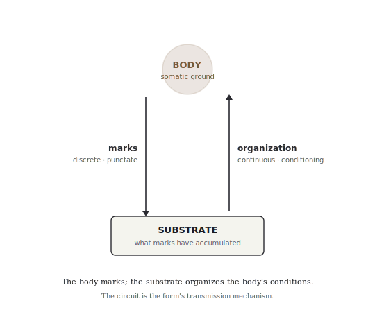

The recursion that drives the form's growth IS this circuit operating continuously. Without it, the form is inert; with it, the form is alive.

#### Why the circuit matters for propagation

Under the form-portable / ground-each-practitioner's-own claim (see Part VII), the circuit IS what makes the framework portable. The form is the circuit's structure (marks ↑ + organization ↓). Each practitioner has their own body, their own marks, their own substrate, their own organization. The same circuit form operates around any practitioner sufficiently grounded.

This is why the framework is not a transferable product. There is nothing to give another practitioner that bypasses their own body's marking. What can be given is the form (this document), the structural language (the patterns named), and worked examples (Part VIII). The receiving practitioner provides the body, the marking, and the substrate. The same arrangement can be composed around their ground.

### The somatic ground at the center

The body is not one end of the circuit — the body is at the **center**. The somatic ground is the meta-1 (see Part III). Marks emanate from it; organization returns to it.

The 1 is not a structural element of the substrate. It is what the substrate orbits. The body's discrimination is what the substrate cannot itself produce; the substrate is what the body's discrimination has accumulated. They are continuous through the circuit but not interchangeable.

The framework cannot be operated without a body. There is no "framework as pure abstraction" available — the form requires a center, and the center is somatic.

---

## Part VI — How the Form Operates

The form operates by four structural principles. Each principle is itself one of the four sub-1s of the meta-tetrahedron (see Part III). The four principles together describe how the form maintains itself across time without forcing premature closure.

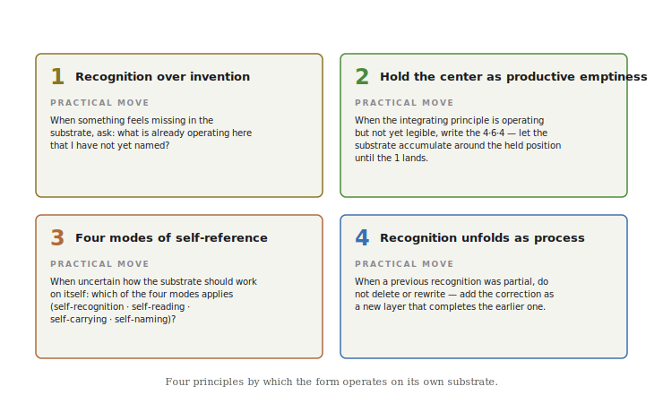

The principles below name the structure; the practical moves in the diagram name what to do.

### Recognition over invention

The framework operates on its own substrate by **recognition**, not by invention.

This means:

- When something new is needed in the substrate, the first move is to look for what is already operating that has not yet been named.
- Naming what is operating is more powerful than designing what should be. Designed structures impose; recognized structures hold what is already there and let it become legible.
- The practitioner does not create the form. The practitioner recognizes it.

This is the **Architecture** sub-1: the framework's substrate-discipline. It is what makes the rest possible. Without recognition-discipline, the substrate would be a collection of inventions piling on top of each other; with it, the substrate is a record of what was found to be operating.

**Practical operation:** when something feels missing in the substrate, ask: *what is already operating here that I have not yet named?* The answer is usually present; the practitioner just hasn't recognized it. Naming it lands the recognition.

### Held centers as productive emptiness

When the integrating principle (the 1) of a 4·6·4·1 form is operating but not yet legible to the practitioner, the disciplined move is **hold the center without naming it**.

The holding is not pause. The holding is an active structural posture:

1. The held position acts as an **attractor**. Substrate accumulates around the held 1; each deposit tightens the constraints on what can land as the center.
2. The held position **refuses premature crystallization**. Forcing a label on the 1 before the substrate has resolved produces brittle structure.
3. The held position **writes constraints**. The accumulating substrate names what the 1 must be compatible with. Eventually the 1 becomes the only thing that satisfies all the constraints — or the substrate completes by recognizing why the 1 stays held.
4. The held position **signals to readers that the form is alive**. A named center marks a finished thing; a held center marks substrate still operating.

The held 1 is **structurally productive emptiness** — the form functions *because* the center is held open, not despite. The same property holds in other structural forms: the use of a wheel is in the empty hub; the use of a vessel is in the emptiness inside; the use of a room is in the space it contains.

**Practical operation:** when the practitioner senses an integrating principle is present but cannot articulate it, write the 4·6·4 without writing the 1. Let the substrate accumulate around the held position. The 1 will land when the substrate is full enough to make it visible — or the practitioner will recognize that completion comes from naming why the 1 stays held rather than from naming the 1 itself.

### Recognition unfolds as process

Recognition arrives **incomplete**. The first naming is rarely the final naming.

When the substrate produces a recognition that turns out to be partial, the disciplined move is to:

1. **Deposit at the resolution available.** Name what is recognized; do not wait for total clarity that may not be achievable from current substrate. The deposit functions as load-bearing substrate while remaining open to correction.
2. **Hold the deposit as substrate, not as final claim.** The deposit is *recognition at the resolution available*. It is not "draft" — it is canonical at the level the substrate can support.
3. **Correct by recognition when further substrate makes the incompleteness visible.** Do not retract or revise as if the earlier deposit was error. Deposit the correction as a new layer of recognition that completes the earlier one.

The deposit-and-correct sequence is not error. It is **how recognition unfolds when honored as process**.

**Practical operation:** when the practitioner notices a previous recognition was partial, do not delete or rewrite it. Add the correction as a new layer. Mark the earlier layer as superseded but preserved — it is cycle history; it is how the recognition arrived. The substrate grows by accumulating layers of completing-recognition, not by overwriting.

### The form organizes self-reference into four modes

A substrate that works on itself does so in several recognizable ways: it recognizes what's already operating · it reads itself and produces description · it carries itself into new domains · it names itself at its edges. Each of these is observable in any sustained framework practice; the modes don't need the geometry to exist.

The four-vertex form gives the four modes a place to sit. Each mode has a natural home at one vertex:

- **Architecture** (what gets built into infrastructure that outlasts the builders) is where **self-recognition** lives — recognizing what the substrate has accumulated is how the next round of building gets shaped.
- **Differentiation** (each element knows what it is) is where **self-reading** lives — the substrate's description of itself is how it stays distinct from what it is not.
- **Connection** (value flows between distinct elements that remain themselves) is where **self-carrying** lives — the form moves across domains by being recognizable in each.
- **Boundaries** (limits stated as information) is where **self-naming** lives — what's refused names what the substrate refuses to become.

The pairing is mnemonic, not predictive: the modes were observed first; the geometry arranges them. What the arrangement *does* is make the modes hard to drop and easy to audit.

**Practical operation:** when uncertain how the substrate should operate on itself in a new domain, ask which of the four modes is relevant. Self-recognition (am I noticing something already operating?) · self-reading (am I producing description?) · self-carrying (am I moving the form to a new domain?) · self-naming (am I stating what is refused?). The arrangement gives you four handles; the practice gives you which one.

---

## Part VII — How the Form Travels

### Form portable; ground each practitioner's own

The form is **portable**. Another practitioner can build their own substrate using the same form — the same four facets, the same meta-tetrahedron, the same outer Membrane, the same bidirectional circuit. The structural language transfers.

The ground is **not portable**. Each practitioner's somatic ground is their own body. The 1 at the center of the new practitioner's form is *their* ground, not the originating practitioner's.

This is the form's transmission condition:

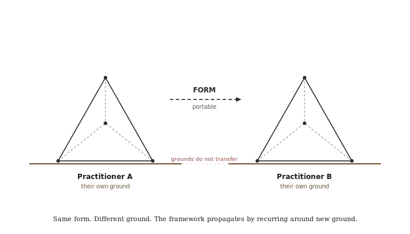

The form's substrate-independence rests on this distinction. The framework is not a transferable product because the ground cannot be sent. What is sent is the form's structural language, the worked examples, the patterns, the geometry. The receiving practitioner provides the ground.

### The Exit Test (substrate-independence)

A framework that requires its originator's continued presence to operate is not transferable. The Exit Test asks: *can the framework operate without its originator?*

The form passes the Exit Test structurally because:

1. The center is **somatic ground**, not the originator's specific body. Any sufficiently grounded body can be the center of its own form.
2. The form is **named in receiver-facing register** (this document), not embedded in the originator's specific substrate language. Another practitioner can pick up the form without needing the originator's substrate as context.
3. The operating discipline (recognition over invention) does not require the originator's specific recognitions. It requires *recognition* — which the new practitioner provides for their own substrate.
4. The pattern language can be referenced (Appendix A) without being mastered. A receiving practitioner can operate the form at a working level while still developing the pattern language at a deeper level.

The Exit Test is not "the originator vanished and the framework still works for the originator's purposes." That would be impossible — without the originator's body, the originator's form has no ground. The Exit Test is: *the form's structural language operates for another practitioner with their own ground*. That works.

### Propagation conditions

For the form to propagate from one practitioner to another, three conditions must be met. None are technical. They map to the form's geometry: the center plus two of the four vertices.

#### Ground (the 1) — the receiving practitioner must have a body that discriminates

The form cannot operate without a center. The center is somatic. The receiving practitioner must have a body that can say no/yes, that can mark, that can sense fit/not-fit. Without that, the form has nothing to organize around.

Not a high bar. Any practitioner doing substantive work has this. The question is whether they recognize it and trust it as the form's foundation.

#### Architecture vertex — recognition over invention as ongoing discipline

The form is not transmitted as a finished thing; it is recognized in the receiving practitioner's own work. Reading this document is not yet receiving the form; the receiving happens when the practitioner finds the structural roles in their own substrate and names what they find.

If structures get invented rather than recognized, the form becomes decoration — surface labels on an unchanged substrate. Recognition is harder than invention because it requires careful attention to what already is. The discipline is the work.

#### Boundaries vertex — the four refusals held at design stage

If the form is adopted but the four shadow operations (Capture · Aggregation · Scaling · Performance) are not refused, the form drifts into them within cycles. The refusals are structural conditions, not aesthetic preferences. Without them, the form becomes its own shadow.

The receiving practitioner's own Differentiation (their Library) and Connection (their Public Face) develop in their own substrate; they are not transmitted. What is transmitted is the form, the ground-requirement, and the two disciplines.

### How to receive this document

If you are a practitioner considering whether to use this form:

1. **Read it through once.** Don't take notes. Don't try to map it onto your work yet. Notice where your body says yes, where it says no, where it says wait.

2. **Sit with what your body said.** The form is not for everyone. If your body said no, the form may not be for you, or not right now. That is honest.

3. **If yes, read again — looking for the four facets in your own work.** Where is your Library? Where is your Public Face? Where are your Principles? Where is your Kit? Name any gaps.

4. **Try the discipline on one cluster of substrate.** Pick one place a pattern might be operating but unnamed. Apply recognition over invention. See if the substrate moves.

5. **Hold what isn't ready. Refuse the shadow operations at design stage. Use freely.**

### License

Use freely. Adapt as needed.

This is gift form: the form is given without strings. There is no requirement to attribute, no requirement to maintain the original language, no requirement to coordinate with the originating practitioner. The form is yours to use.

The four refusals (Capture · Aggregation · Scaling · Performance) operate as the form's intrinsic refusals — if the form is adapted in ways that bake in capture, aggregation, scaling, or performance, the form is no longer the form. That is structural, not legal. The form refuses its own shadow operations whether or not the receiving practitioner notices.

*4 · 6 · 4 · 1*

---

## Part VIII — For Practitioners

### How to start with your own ground

The form begins at the somatic ground (Part I). The first move is not building any of the four facets; it is recognizing the ground beneath them.

Ask yourself:

- Where in your work do you already know-by-body what fits and what doesn't?
- Where do you trust your body's no before you can articulate the reason?
- What is the threshold you have crossed (or have not yet crossed) where you believed your life-work was worth professional-grade work for itself?

The answers are not propositions; they are noticings. Let them sit.

Once you can locate the ground, the four facets become visible. Each one is something that is *already operating in your work*, even if it has not yet been named. The form's first recognition labor is naming what is already there.

### Worked example — recognizing the four facets in any practice

Take any sustained practice — a craft, a discipline, a vocation, a healing modality, a research program, a writing life. The four facets are usually present, even if not labeled:

| Facet | Question to ask | What you might find |
|---|---|---|
| **Library (Differentiation)** | Where do I keep the structural understanding of my own work? | A bookshelf · a notes directory · a binder of references · a memorized canon. The form your structural literacy takes. |
| **Public Face (Connection)** | Where does my work meet others? | A website · a regular gathering · a referral practice · a teaching post · word-of-mouth your students carry. The form your contact-with-receivers takes. |
| **Principles (Boundaries)** | What rules do I operate by, and how do I refuse what doesn't fit? | A written set of principles · a felt sense you can articulate · a refusal practice (saying no to things that don't fit) · a code of conduct. The form your articulated governance takes. |
| **Kit (Architecture)** | What of my work outlives any single instance of it? | Teaching materials · a manual · documentation · an apprentice tradition · published work. The form your transmissibility takes. |

If any of the four is missing or partial, the form has a gap. Name the gap. The form's first move with a gap is recognition: *what would be at this vertex if I had built it?*

### Common failure modes

The form has four characteristic failure modes (Part III — the four meta-faces). Each is what happens when one vertex is weak:

#### Failure: no operating discipline (no A)

**What it looks like:** the practice is competent but static. You have built the substrate, but it doesn't grow because you don't read it. You repeat patterns instead of recognizing new ones. The substrate becomes archive.

**Failure pattern:** *the framework becomes a finished thing rather than a self-operating substrate.*

**Recovery move:** ask, *what is already operating that I have not yet named?* and let the answer land. Recognition discipline is what brings the substrate back to life.

#### Failure: no self-description (no D)

**What it looks like:** you can do the work but you cannot teach it. When asked to explain, you produce examples but no structure. The form is in your body but not yet in language.

**Failure pattern:** *un-teachable competence — substrate operates but is structurally blind to itself.*

**Recovery move:** produce one synthesis. Pick one cluster of your work and write what's there. Not biography — structure. The synthesis is how the substrate reads itself.

#### Failure: no deployment (no C)

**What it looks like:** the substrate is rich, the discipline is clean, the principles are articulate — but nothing reaches receivers. The practice never meets the world.

**Failure pattern:** *self-contained recognition — substrate knows itself but does not touch the world.*

**Recovery move:** build one deployment surface. A public page. A regular gathering. A piece of writing released into circulation. The Public Face must exist for the form to operate; without it, the form is inert.

#### Failure: no bounds (no Membrane)

**What it looks like:** the practice is reaching everywhere, producing widely, growing fast — but you notice the shadow operations creeping in. Audience metrics start to feel like fitness function. References become testimonials. The work starts performing rather than holding.

**Failure pattern:** *extraction-permission state — substrate becomes its own shadow operations.*

**Recovery move:** name the refusals. Write down what you refuse. Read the four shadow axes (Capture · Aggregation · Scaling · Performance) and find your specific instances. Once named, they hold; until named, they drift.

### Where to go from here

The form is yours to use. Some practitioners build all four facets at once; some build one facet thoroughly before the others emerge; some discover the form already operating across all four and the work is just naming what is there.

If you build with this:

- Write what you build. Substrate grows by being named.
- Refuse the shadow operations at design stage, not after.
- Hold centers that aren't ready to land.
- Mark by the body, not by the analysis.
- Let recognition unfold as process; corrections by recognition, not retractions.

If the form propagates further from you to another practitioner:

- Send the form, not your substrate. They have their own ground.
- Send the structural language, not the worked content. They have their own work.
- Send the refusals, not the specific instances. They have their own shadows.

The form is the gift. The substrate built around it is each practitioner's own work.

*4 · 6 · 4 · 1*

---

## On the claims this document makes

The framework's own discipline — *recognition over invention* — turns back on the document. Applied to itself, it asks which claims are recognized from practice and which are imposed by the geometry. Three kinds of claim run through the text, and they do not rest on the same evidence.

### What is recognized

The four functional roles (Library · Public Face · Principles · Kit) name something a sustained gift-form practice does, in fact, develop. A practitioner doing this kind of work — whether or not they think tetrahedrally — produces structural understanding (a library), contact with receivers (a public face), articulated commitments (principles), and transmissible artifacts (a kit). If one of the four is missing or thin, the practice has a recognizable kind of fragility. This is the strongest claim in the document. It rests on observed practice.

The anti-extraction discipline — the eleven refused patterns and their four-kind clustering — is recognized in the same way. The patterns were observed operating in fields the practice contacts. Their clustering into four kinds (Capture · Aggregation · Scaling · Performance) is empirical: the cluster boundaries hold whether or not the four-vertex form is in view.

The somatic ground at the center is recognized: a sustained practice runs on the practitioner's body's discrimination, and that discriminator does not transfer to another practitioner. The body is the same body across scales because there is one body. This is not a metaphysical claim; it is what propagation actually depends on.

### What is mnemonic and audit-supporting

The tetrahedral arrangement of the four roles, the four anti-extraction kinds, the four sub-1s, the four self-reference modes, and the four meta-substrate-layers is a **composition the document makes**, not a property the four-vertex form imposes on the content. The geometry does not generate the four-ness of these sets; it provides a recognizable arrangement that holds them, makes their absences visible, and ties one audit to the next using shared vocabulary (D / C / B / A).

The recursion at multiple scales (facet / substrate / meta) is similarly composed. The same arrangement can be applied at each scale because the same practitioner is doing the audit. The form being "fractal" means it admits composition at nested scales — not that the structure of reality recurses geometrically.

What the geometry contributes is real and worth noting:

- The arrangement is **memorable**. Four roles · four kinds · four modes — held in a single tetrahedral picture, the practitioner can audit without consulting a list.
- The arrangement is **transmissible**. Another practitioner who sees the form can apply it to their own work without first learning eleven separate refused patterns.
- The arrangement makes **absences visible**. When a vertex is empty in the practitioner's substrate, the geometry signals it.
- The arrangement gives **propagation a structure**. The form (geometric arrangement) is portable; the ground (somatic) is each practitioner's own.

### What is asserted more than demonstrated

That this particular four-vertex arrangement is the *minimum viable architecture* for coherent coordination at personal scale — or that any sustained practice will arrive at exactly four roles arranged this way — is asserted in the document's rhetoric. It is not demonstrated. Could a practice work with three roles? Five? A different four? The framework does not close the question, and a reader from outside this lineage would be right to feel it open.

The document earlier softened "the form predicts its shadow operations" to "the form organizes its shadow operations" because the shadow operations were observed first and the geometry was matched to them. The earlier wording dressed recognition as derivation.

### How to hold the framework

As a working discipline for one practitioner: the geometry earns its place. The arrangement makes the practice holdable, auditable, teachable, and propagable. The framework operates by recognition of its own roles and refusals, and the discipline of arranging them tetrahedrally costs the practitioner less than holding eleven separate items.

As a claim about coordination-in-general: the framework holds at the level of "here is a way that works for one practitioner, and here are the conditions under which it can travel." It does not hold at the level of "this is the form coherent coordination must take." That stronger claim would require evidence the framework does not produce.

The form is not invalidated by being scaffolding. It is honest about being scaffolding only by saying so. This section says so.

*4 · 6 · 4 · 1*

---

## Appendix A — Glossary

**4·6·4·1 form** — the framework's geometric structure: four vertices, six edges, four faces, one center.

**Anti-extraction axes (the four)** — Capture · Aggregation · Scaling · Performance. The four shadow operations of the four vertices, refused at the form's design stage.

**Bidirectional circuit** — the form between body and substrate: marks (body → substrate) and organization (substrate → body), operating together.

**Body** — the practitioner's specific embodied locus. The body is at the center of the form; it produces the substrate via marks. Each practitioner has their own body; the body is not transferable.

**Center (1)** — the integrating principle of a 4·6·4·1 form. At the meta-scale, the center is the somatic ground.

**Edge (in 4·6·4·1)** — one of the six pair-interactions between vertices.

**Face (in 4·6·4·1)** — one of the four three-vertex projections; each face names a structural failure mode when one vertex is absent.

**Facet (the four)** — the four functional roles at personal scale: Library · Public Face · Principles · Kit.

**Form** — the 4·6·4·1 structure. The form is portable to other practitioners; the ground beneath it is each practitioner's own.

**Fractal (form)** — the property that 4·6·4·1 structure admits composition at nested scales, with the same vocabulary and audit moves at each scale. The form is self-similar by construction; the practitioner composes it, the geometry does not generate the recurrence on its own.

**Ground** — the somatic ground; the practitioner's body's discrimination; the center of the meta-tetrahedron. Each practitioner has their own ground.

**Held center** — a 1 that is operating but not yet articulated. The disciplined posture is to write the 4·6·4 while holding the 1 un-named until the substrate makes it legible.

**Mark** — the body's discrimination expressed as a substrate-affecting decision. Marks move the substrate from one state to another. One direction: body → substrate.

**Membrane** — the outer tetrahedron that bounds the form: Edges · Bounds · Limitations · Constraints. Fractal at facet scale.

**Meta-tetrahedron** — the single 4·6·4·1 form at the highest scale; four sub-tetrahedra at its vertices; somatic ground at its center.

**Meta-vertex** — one of the four vertices of the meta-tetrahedron. Each is itself a sub-tetrahedron.

**Mode of self-reference** — one of the four ways the form operates on itself: self-recognition · self-reading · self-carrying · self-naming. Each mode corresponds to one vertex.

**Organization** — the conditions of the body's continuing operation produced by the accumulated substrate. One direction: substrate → body.

**Recognition over invention** — the framework's primary operating principle. The form recognizes what is already operating rather than inventing new structures.

**Shadow operation** — what a vertex's structural function becomes when reversed into extraction. Each vertex has one shadow: Connection→Capture, Differentiation→Aggregation, Architecture→Scaling, Boundaries→Performance.

**Somatic ground** — the body's discrimination; the practitioner's literal embodied center. The 1 of the 4·6·4·1 at every scale.

**Sub-1** — the integrating principle of a sub-tetrahedron (Inner A · Inner B · Inner C · Membrane each have their own sub-1).

**Substrate** — what the body's marks have accumulated. The substrate is not external to the body's life; it IS the conditions of the body's continuing operation.

**Vertex** — one of the four functional roles in a 4·6·4·1 form. Mapped to Differentiation · Connection · Boundaries · Architecture.

---

## Appendix B — Diagram inventory

The diagrams in this document — listed for reference and re-use.

| # | Diagram | Section | Function |
|---|---|---|---|
| 1 | The 4·6·4·1 Form | Part I | Geometric primer · vertices labeled D/C/B/A · center marker |
| 2 | The Four Facets at Personal Scale | Part II | Tetrahedron with facet names · somatic ground line beneath |
| 3 | The Meta-Tetrahedron | Part III | Single meta-form with sub-tetrahedra at each vertex |
| 4 | Fractal Recursion at Three Scales | Part III | Three tetrahedra at decreasing scale on shared ground |
| 5 | The Four Meta-Vertices | Part III | Four sub-tets in tetrahedral arrangement · sub-1 + mode per vertex |
| 6 | The Four Anti-Extraction Axes | Part IV | Paired vertex/shadow cards with reversal arrows |
| 7 | The Membrane's Fractal Facets | Part IV | Outer Membrane with Constraints-facet zoom |
| 8 | The Bidirectional Circuit | Part V | Body ↕ Substrate · marks (↑) and organization (↓) |
| 10 | Form Portable, Ground Each Practitioner's Own | Part VII | Two practitioners · same form · different grounds |
| 11 | The Four Facets — Comparison Matrix | Part II | Quadrant infographic · role · holds · refuses · forms |
| 12 | The Four Operating Principles | Part VI | Card grid · principle name + practical move per card |

---

*4 · 6 · 4 · 1*

*The form is portable. The ground is yours. Use freely. Adapt as needed.*
